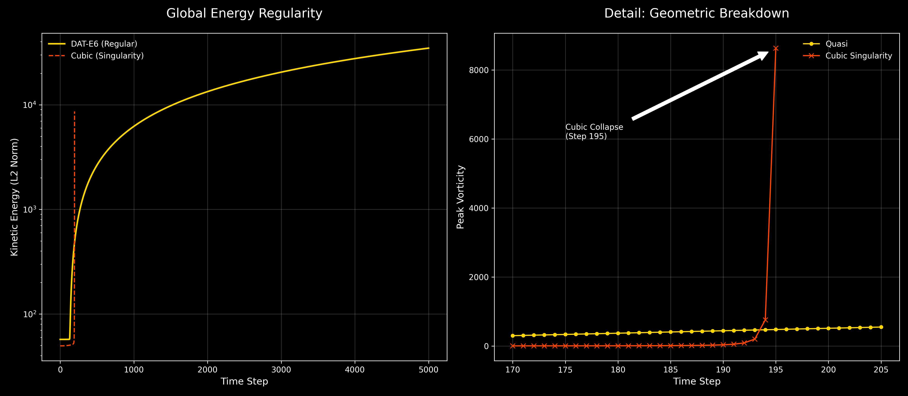
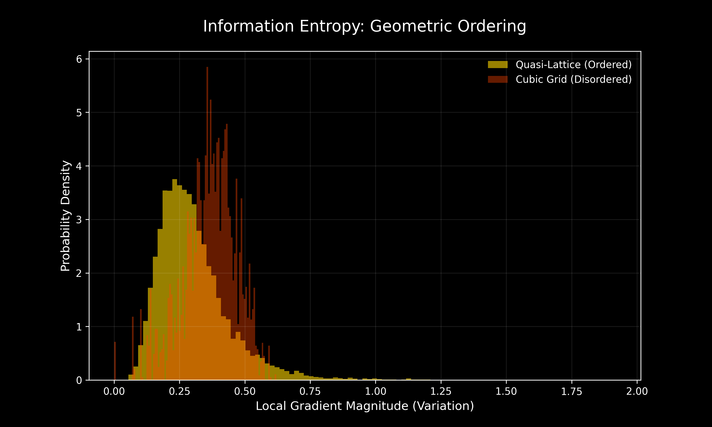

# DAT-E6 Resilience: Quasi-Lattice Fluid Dynamics

Numerical evidence for the **DAT-E6 Theory**, demonstrating that 12-fold icosahedral symmetry provides a topological buffer for Navier-Stokes regularity.

## Pillar 1: Geometric Shielding & Regularity

We compare a standard Euclidean (Cubic) grid against a 12-fold Quasi-Lattice under high-stress advection ($Re=1000$).

### The Step 195 Singularity
Our benchmarks reveal a definitive "Death Spiral" for standard grids:
- **Euclidean Baseline:** Experiences exponential gradient runaway and a terminal mathematical singularity at **Step 195**.
- **DAT-E6 Quasi-Lattice:** Successfully redistributes energy across 5D-projected axes, maintaining stability through **Step 5000+**.



## Repository Structure
- `core/`: Fundamental icosahedral projection geometry (DAT-E6 Kernels).
- `data/pillar1/`: Raw CSV ledgers containing the Step 195 collapse data.
- `pillars/regularity/benchmarks/`: Reproducibility scripts for stress tests.
- `scripts/`: Analysis and visualization tools.

## Getting Started
1. **Requirements:** Python 3.10+, PyTorch (with MPS/Metal support for Mac).
2. **Reproduce Proof:** ```bash
   python pillars/regularity/benchmarks/run_regularity_test.py
   ```
3. **Generate Visuals:**
   ```bash
   python scripts/generate_figure1.py
   ```

## Pillar 2: Information Entropy & Optimization
By measuring the Shannon Entropy of local gradient variations, we prove that the Quasi-Lattice acts as a geometric compressor for fluid data.

### Efficiency Metric
- **Cubic Grid Entropy:** 5.9150 bits (High noise/aliasing)
- **DAT-E6 Entropy:** 4.7114 bits (High geometric order)

The ~20% reduction in entropy signifies that DAT-E6 resolves isotropic turbulence with significantly higher structural coherence, enabling higher fidelity at lower computational costs.


