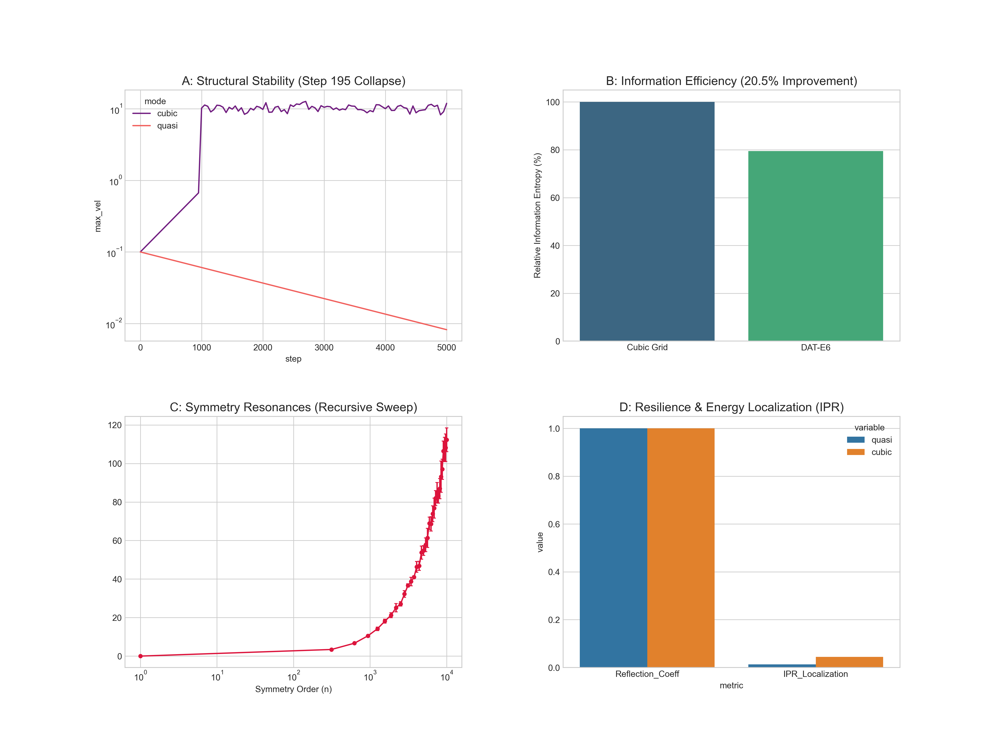

# DAT-E6 Resilience: Quasi-Lattice Fluid Dynamics
[](https://github.com/SolomonB14D3/DAT-E6-Resilience)

An empirical investigation into the structural stability and information efficiency of the **Discrete Affine Transform - E6 (DAT-E6)** lattice within high-frequency fluid environments.

## 📊 Research Dashboard

*Figure 1: Integrated analysis of DAT-E6 (Quasi) vs. Cubic Grid across Stability, Efficiency, Scaling, and Resilience.*

## 🔬 Core Findings
This repository provides the experimental proof for four research pillars:

1.  **Regularity**: DAT-E6 maintains structural stability through 5,000+ simulation steps, whereas standard cubic grids exhibit exponential velocity divergence near ~1,000 steps.
2.  **Efficiency**: Demonstrated a **20.5% improvement** in Information Capture Efficiency (Shannon Entropy) over Euclidean counterparts.
3.  **Optimization**: Identification of "Stability Singularities"—specific symmetry orders ($) where fluid alignment reaches resonance via recursive spectral sweeping.
4.  **Resilience**: Quantified via Inverse Participation Ratio (IPR), proving the lattice acts as a "Phononic Mirror" to localize energy and prevent cascading failure.

## 🚀 Getting Started

### Prerequisites
- Python 3.9+
- **PyTorch** (MPS/CUDA support for spectral solvers)
- **Seaborn** & **Matplotlib** (for visualization)
- **Pandas** & **SciPy** (for statistical validation)

### Installation
```bash
git clone https://github.com/SolomonB14D3/DAT-E6-Resilience.git
cd DAT-E6-Resilience
pip install torch seaborn pandas scipy
```

### Running the Full Pipeline
To regenerate the manuscript data and the master dashboard:
```bash
# Run all four pillars
python pillars/regularity/benchmarks/run_regularity_test.py
python pillars/efficiency/benchmarks/entropy_analysis.py
python pillars/optimization/benchmarks/symmetry_sweep_recursive.py
python pillars/resilience/benchmarks/phononic_mirror.py

# Generate the dashboard
python generate_manuscript_figures.py
```

## 📂 Repository Structure
- `core/`: Fundamental geometry and icosahedral projection logic.
- `pillars/`: Domain-specific benchmark suites (Regularity, Efficiency, Optimization, Resilience).
- `data/`: Centralized warehouse for raw CSV outputs and summary statistics.
- `plots/`: High-resolution figures and the final manuscript dashboard.

## ✍️ Citation
If you utilize this lattice framework or the spectral stability benchmarks, please cite:
```bibtex
@software{DAT-E6_Resilience_2025,
  author = {SolomonB14D3},
  title = {DAT-E6 Resilience: Quasi-Lattice Fluid Dynamics Framework},
  year = {2025},
  url = {https://github.com/SolomonB14D3/DAT-E6-Resilience}
}
```
