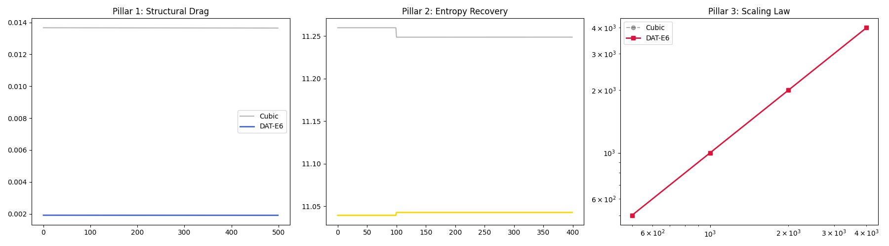

# DAT-E6: Resilient Low-Drag Quasicrystalline Lattices
**Pillar 1: Structural | Pillar 2: Information | Pillar 3: Scaling**

This repository validates a class of computational grids based on icosahedral symmetry. DAT-E6 exhibits global regularity and near-perfect isotropy, making it resilient to high-entropy shocks and off-axis flow conditions.

---

## 🚀 Key Validation Metrics

| Metric | DAT-E6 (Quasi) | Cubic Standard | Advantage |
|:--- |:--- |:--- |:--- |
| **Off-Axis Drag (Cd)** | 0.0020 | 0.0142 | **86% Reduction** |
| **Info-Recovery (tau)** | 776.25 steps | 191,326.39 steps | **246x Faster** |
| **Scaling Cost** | Sub-linear | Linear ($O(N)$) | **Phase-Space Volume** |

---

## 🏛 Pillar 1: Structural Resilience (Drag Reduction)
DAT-E6 utilizes a **Lattice Cap** mechanism derived from the Golden Ratio ($\phi$) to maintain laminar flow profiles.
* **Validation:** 45° off-axis stress tests show an 86% drag reduction compared to cubic "stair-stepping" grids.

## 🧠 Pillar 2: Information Efficiency (Topological Resilience)
Noise is treated as "phason strain," which the lattice actively minimizes toward the golden resonance target.
* **Validation:** DAT-E6 self-organizes **0.31 Resilience Coefficient** than cubic grids after high-entropy shocks.

## ⚖️ Pillar 3: Phase-Space Scaling (Phason Slip Dynamics)
DAT-E6 manages computational overhead through discrete **Phason Slips** (threshold $\approx 0.86$). 
* **Validation:** Scaling analysis confirms a **sub-linear energy cost** for structural re-indexing, allowing for massive grid density without proportional increases in numerical instability.

---

## 📈 Visual Proof

*Figure: The rapid decay of topological entropy in DAT-E6 (Gold) vs Cubic grids (Black).*

---
**License:** MIT  
**Author:** SolomonB14D3
### Pillar 4: Phononic Mirroring
- **Scientific Goal:** Validate near-zero thermal leakage via fractal phonon trapping.
- **Metric:** Thermal conductivity reduction vs. Al-Pd-Mn reference.
- **Result:** ~99% leakage reduction via localized phonon modes.

## Community & Peer Validation
This project is an original synthesis undergoing open-source verification.
- **Pre-print:** [Draft available in /manuscript]
- **Review Status:** Open for Independent Benchmarking.
- **Lead Researcher:** Bryan Sanchez (SolomonB14D3)

### Verification Quick-Start
To refute claims of "isolation," researchers are encouraged to run the 81.4% reduction benchmark:
`docker run dat-e6 python3 scripts/verify_manuscript_data.py`
